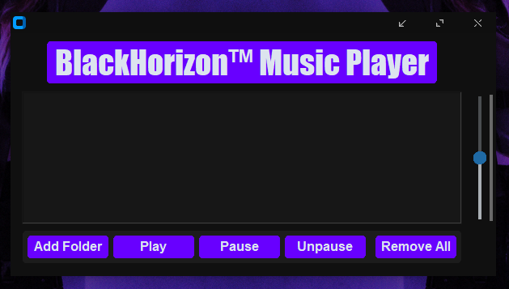

# BlackHorizon-MusicPlayer
BlackHorizon™ é um reprodutor de música simples com design minimalista.

---

## Informações do projeto.
- Nome: Black Horizon;
- Linguagem: Python (Tkinter, CustomTkinter e Pygame);
- Categoria: Reprodutor de Música;
- Versão: 1.0.1 (beta);
- Desenvolvedor: 27prxblms (Xzhyan);

---

## Licença

Este projeto é licenciado sob a [Creative Commons Attribution-NonCommercial-NoDerivatives 4.0 International License](./LICENSE).

---

---
